# 🏎️ F1 GridScope


A comprehensive Formula 1 data explorer web app covering seasons 2021–2026. Built with Python Flask and vanilla JavaScript.

## Live Demo
🔗 **[https://noorfatimaavyn.pythonanywhere.com](https://noorfatimaavyn.pythonanywhere.com)**

## Features

- **Season Archive** — Browse complete F1 seasons from 2021 to 2026
- **Driver Grid** — Full driver lineup with real headshot photos and standings
- **Race Calendar** — Complete race schedule with podium results on click
- **Circuit Archive** — All F1 circuits with historical winners (2021–2026)
- **Circuit Detail Pages** — Dedicated page per circuit with winners history
- **F1 Cars** — Technical breakdown of all team cars per season with Wikipedia images
- **AI Race Predictor** — Gemini AI predicts top 5 finishers for any race based on current standings and circuit history
- **F1 AI Chatbox** — Ask anything about F1, powered by Gemini AI (F1-only responses)

## Tech Stack

| Layer | Technology |
|-------|-----------|
| Backend | Python + Flask |
| Frontend | HTML + CSS + JavaScript |
| Database | Firebase Firestore |
| F1 Data | Jolpica F1 API + OpenF1 API |
| AI | Google Gemini API |
| Deployment | Railway |
| Version Control | GitHub |

## Data Sources

- **Jolpica F1 API** — Race results, standings, drivers, circuits (free, no key needed)
- **OpenF1 API** — Driver headshots and live session data
- **Wikipedia API** — Car and circuit images
- **Google Gemini** — AI predictions and chatbox

## Project Structure


## Setup

```bash
# Clone the repo
git clone https://github.com/NoorFatima-avyn/f1-grdscope.git
cd f1-grdscope

# Create virtual environment
python -m venv venv
venv\Scripts\activate  # Windows

# Install dependencies
cd backend
pip install -r requirements.txt

# Add environment variables
# Create .env file with:
GEMINI_API_KEY=your_key_here
SUPABASE_URL=your_url_here
SUPABASE_SECRET_KEY=your_key_here


# Run
python app.py
```

## Screenshots

A closer look at GridScope across seasons, drivers, races, cars, and circuits.

<table>
<tr>
<td width="50%"><b>Home</b><br>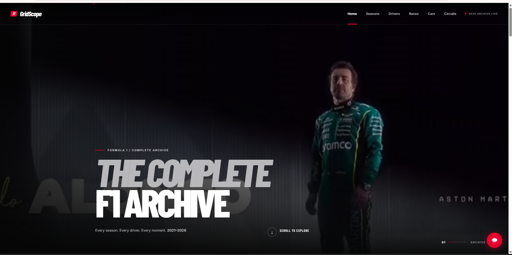</td>
<td width="50%"><b>Home — rotating driver banner</b><br>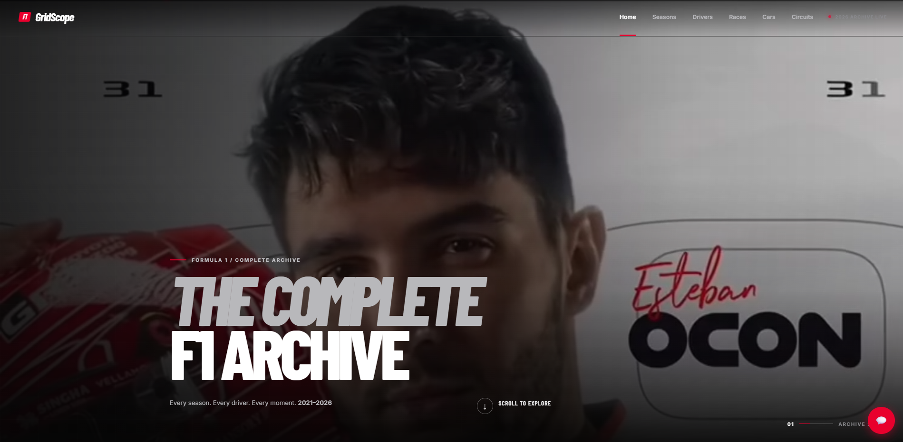</td>
</tr>
<tr>
<td width="50%"><b>Season Archive</b><br>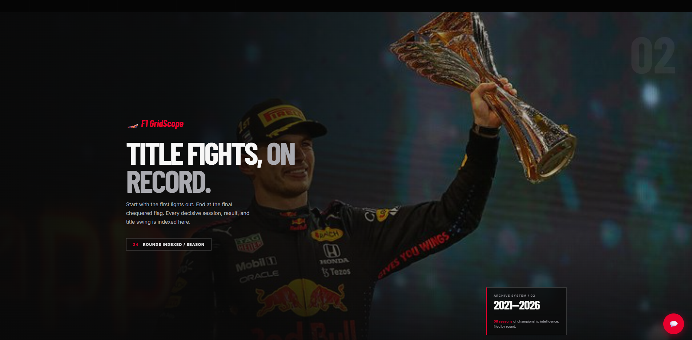</td>
<td width="50%"><b>Season Snapshot</b><br>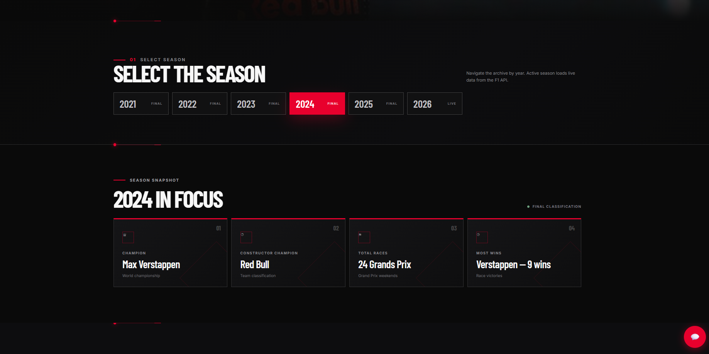</td>
</tr>
<tr>
<td width="50%"><b>Race Calendar</b><br>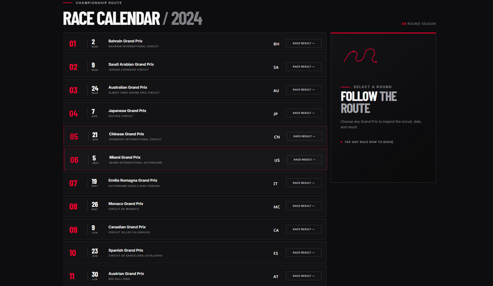</td>
<td width="50%"><b>AI Race Predictor</b><br>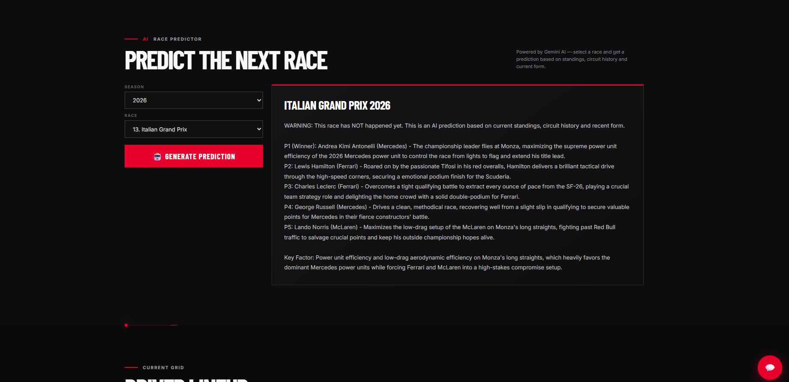</td>
</tr>
<tr>
<td width="50%"><b>Driver Lineup</b><br>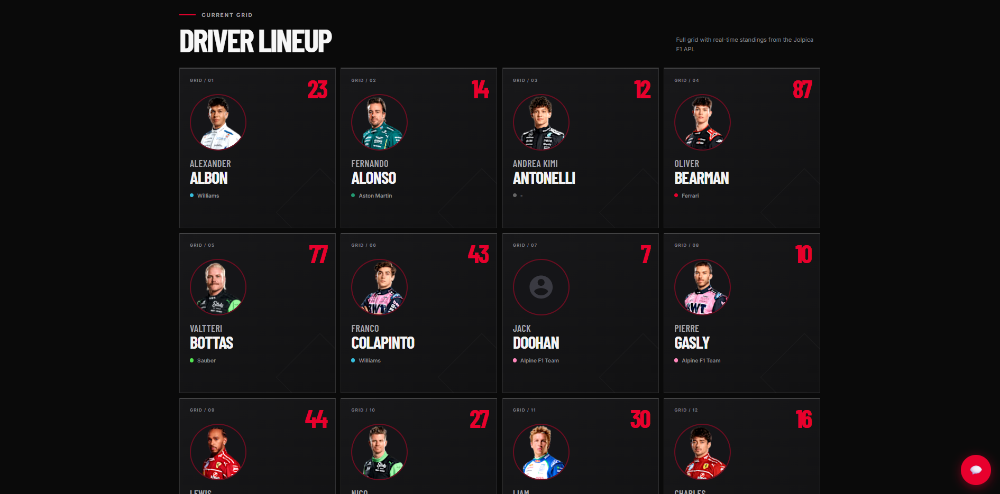</td>
<td width="50%"><b>Cars Archive</b><br>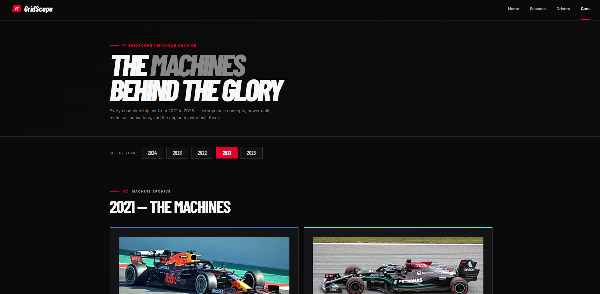</td>
</tr>
<tr>
<td width="50%"><b>Car Detail</b><br>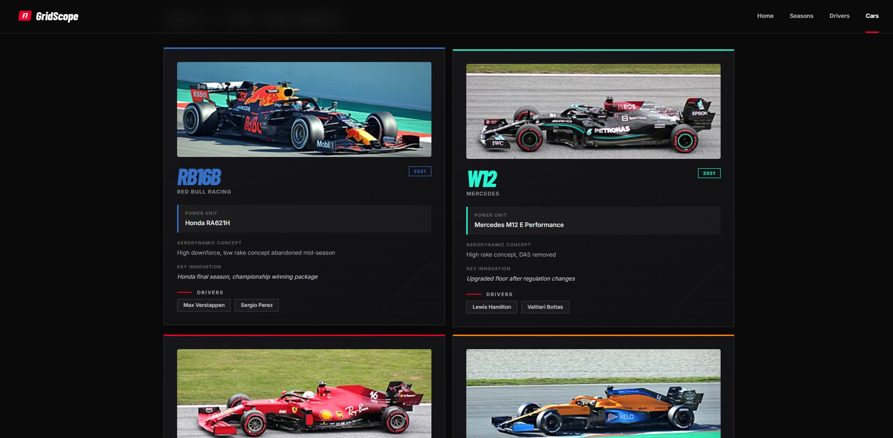</td>
<td width="50%"><b>Circuit Detail</b><br>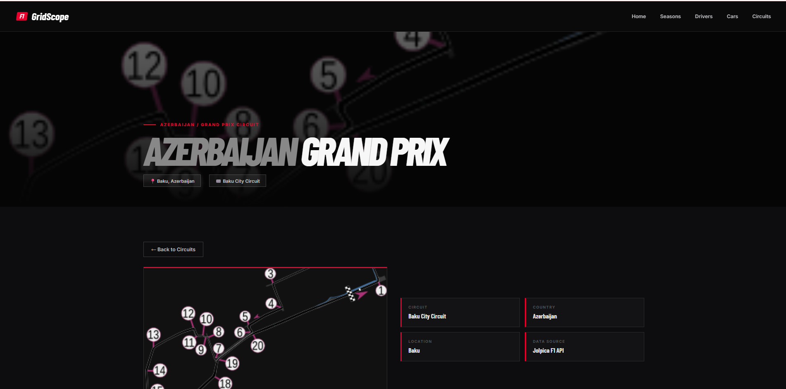</td>
</tr>
<tr>
<td width="50%"><b>Circuit — Historical Winners</b><br>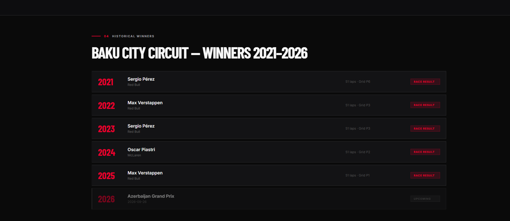</td>
<td width="50%"></td>
</tr>
</table>

## Demo

🎥 A full screen recording walkthrough of GridScope is available here: **[Add your screen recording link here]**

> To add it: either commit the video to the repo (e.g. `assets/demo.mp4`, keep it under 100MB) and embed it with
> `<video src="assets/demo.mp4" controls width="800"></video>` — this only renders on GitHub's web view — or host it on YouTube/Loom and paste the link above.

## Made by

Noor Fatima — BS Artificial Intelligence, NuTech